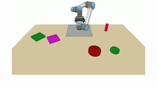

# Language-Conditioned Imitation Learning (Dataset)

This dataset accompanies the paper [_"Language-Conditioned Imitation Learning for Robot Manipulation Tasks"_ ](https://arxiv.org/abs/2010.12083) that was published as a spotlight paper at NeurIPS 2020. Utilizing this dataset for policy training and evaluation requires the code provided in our [official GitHub](https://github.com/ir-lab/LanguagePolicies). 

For transferability purposes, we published the dataset as a separate entity and provided a small set of helpers to explore the data. The dataset generally contains 44,890 collected samples grouped into 22,445 _picking_ and 22,445 matching _pouring_ tasks that directly follow their respective picking task.

<div style="text-align:center"></div>

The above image demonstrates two samples for the tasks of _"Raise the red cup"_ and _"Fill a little into the large green bowl"_. Each sample has an associated language instruction that describes _what_ to do (i.e., picking or pouring), _where_ to do it (referencing one of our twelve objects), and most importantly, in the case of a pouring task _how_ to do it (describing whether to pour _a little_ or _a lot_). Thus, in this dataset, language is not just used for goal conditioning but also to describe the motion itself needed to complete the task.

When using this dataset, we would apprechiate the following citation:
```
@inproceedings{NEURIPS2020_9909794d,
 author = {Stepputtis, Simon and Campbell, Joseph and Phielipp, Mariano and Lee, Stefan and Baral, Chitta and Ben Amor, Heni},
 booktitle = {Advances in Neural Information Processing Systems},
 editor = {H. Larochelle and M. Ranzato and R. Hadsell and M.F. Balcan and H. Lin},
 pages = {13139--13150},
 publisher = {Curran Associates, Inc.},
 title = {Language-Conditioned Imitation Learning for Robot Manipulation Tasks},
 url = {https://proceedings.neurips.cc/paper_files/paper/2020/file/9909794d52985cbc5d95c26e31125d1a-Paper.pdf},
 volume = {33},
 year = {2020}
}

```

## Dataset Initialization
We provide our dataset as a compressed tar.gz archive that can be downloaded here from [Google Drive](https://drive.google.com/file/d/1ssZUdL3PIrppug5kRhwQhP-InCA1y9nY/view?usp=drive_link) (~7GB Download)

Place the downloaded file in the root directory of this repository and extract it as follows:
```
tar xvf data_raw.tar.gz
```
> **_N0TE:_** The extracted data will take ~140GB of storage space due to being human-readable JSON. 

## Task Description

Our task is set up as a tabletop manipulation setting in which a single UR5 robot arm is tasked with picking one of three differently colored cups and then pouring a specified amount of the grasped cup's content into one of our 20 bowl. Below, we describe each cup and bowl with respect to their visual features:

| ID | Type | Color  | Size  | Shape  |
| -- | :--: | :----: | :---: | :----: |
| 1  | cup  | red    |  n/a  |  n/a   |
| 2  | cup  | green  |  n/a  |  n/a   |
| 3  | cup  | blue   |  n/a  |  n/a   |

| ID | Type | Color  | Size  | Shape  |
| -- | :--: | :----: | :---: | :----: |
| 1  | bowl | yellow | small | round  |
| 2  | bowl | red    | small | round  |
| 3  | bowl | green  | small | round  |
| 4  | bowl | blue   | small | round  |
| 5  | bowl | pink   | small | round  |
| 6  | bowl | yellow | large | round  |
| 7  | bowl | red    | large | round  |
| 8  | bowl | green  | large | round  |
| 9  | bowl | blue   | large | round  |
| 10 | bowl | pink   | large | round  |
| 11 | bowl | yellow | small | square |
| 12 | bowl | red    | small | square |
| 13 | bowl | green  | small | square |
| 14 | bowl | blue   | small | square |
| 15 | bowl | pink   | small | square |
| 16 | bowl | yellow | large | square |
| 17 | bowl | red    | large | square |
| 18 | bowl | green  | large | square |
| 19 | bowl | blue   | large | square |
| 20 | bowl | pink   | large | square |

## Dataset Structure

All data samples can be found in the "_/raw_" folder; however, we provide a single example in the "_/example_" to provide a brief overview. Each file is in standard JSON format that any such parser should be able to read. 

Each sample has a unique ID is composed of a _picking_ and subsequent _pouring_ action. In the data folder, there are two files with the same ID, followed by _\_1_ and and _\_2_, where _\_1_ contains the _picking_ and _\_2_ contains the corresponding _pouring_ action. 

> **_N0TE:_** The data in _trajectory_ is not used to train our models! This data is only used to initially control the robot during data collection in lieu of kinesthetic teaching or teleportation. Do not use this data for your own model training.

The fields in the JSON file are as follows:

- __amount__: Describing the amount poured. 110 degrees for _some_ and 180 for _all_. While available in the picking task, the value is only used in the pouring task.
- __target/id__: The id of the target object. See the table in [Task Description](#task-description)
- __target/type__: Type of the target, either _cup_ or _bowl_. See the table in [Task Description](#task-description)
- __trajectory__: The initially generated trajectory that is executed by the robot during data collection. This trajectory has been automatically generated to fulfill the desired task. Motions are generated as a set of waypoints, converted to joint configurations with an inverse kinematics, and finally linearly sampled to fill-in trajectory. 
- __name__: The name of this demonstration. Overall, there will be two files with the same name. One for the pocking, one for the pouring action.
- __phase__: Either 0 or 1, where 0 indicates the picking, and 1 indicates the pouring action. Note that the file names are using extensions _1 for picking and _2 for pouring.
- __image__: An array containing the top-down image of the environment in uint8 format. The image is of size (320, 569, 3) in BGR format (for visualization with matplotlib, you will need to flip the last axis).
- __ints__: Describes how many and which cups and bowls are in the environment. Index 0 holds the number of bowls, index 1 the number of cups, followed by the bowl and cup IDs used. See the table in [Task Description](#task-description) for the ids.
- __floats__: For each bowl and cup, there are three values. The first two describe the x/y position of the object in the robot coordinate frame, while the third value describes its rotation around the z-axis. 
- __state/raw__: Holds the raw robot state recorded during data collection when executing the trajectory given in _trajectroy_. This data is used for training our models. The values are as follows: 
    - 6x robot joint position (j1, j2, j3, j4, j5, j6)
    - 6x robot joint velocity (j1, j2, j3, j4, j5, j6) (Not Used)
    - 3x robot tool-center-point position (x, y, z) (Not Used)
    - 3x robot tool-center-point rotation (x, y, z) (Not Used)
    - 3x robot tool-center-point linear velocity (x, y, z) (Not Used)
    - 3x robot tool-center-point angular velocity (x, y, z) (Not Used)
    - 3x robot tool-center-point target position (x, y, z) (Not Used)
    - 3x robot tool-center-point target rotation (x, y, z) (Not Used)
    - 1x gripper position
    - 1x gripper joint velocity (Not Used)
- __state/dict__: Same as state/raw, but as a parsed dictionary. See state/raw for descriptions
- __voice__: The voice command used for this demonstration

## Exploring the Data

We provide a small tool to visualize the data. Without extracting the full dataset, you can utilize the single example provided in the _/sample_ folder. To explore a sample, run the following code

```
python explore_sample.py --sample ./sample/0grm2RA9ZnK
```
This will plot the robot trajectory (_state/raw_ used for training), instruction, and render the image used to initialize the task. 
